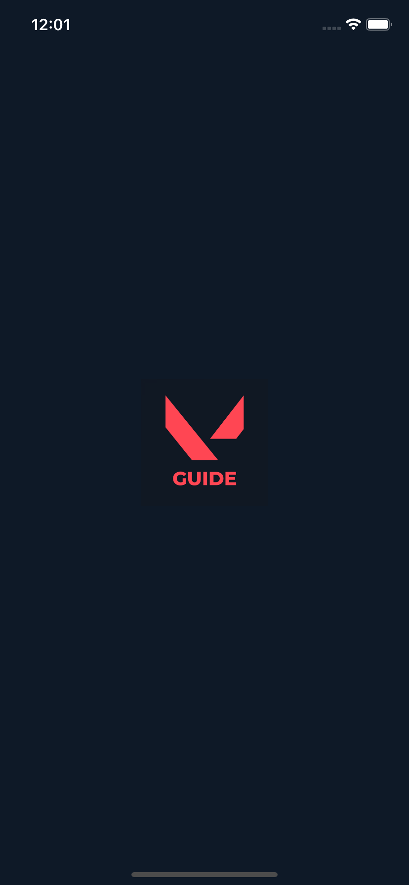
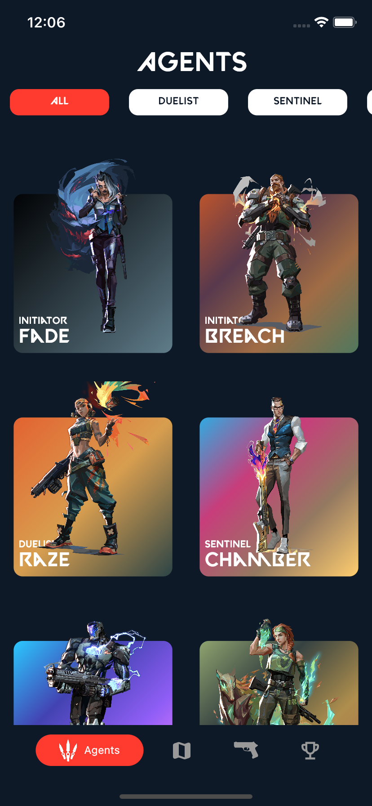
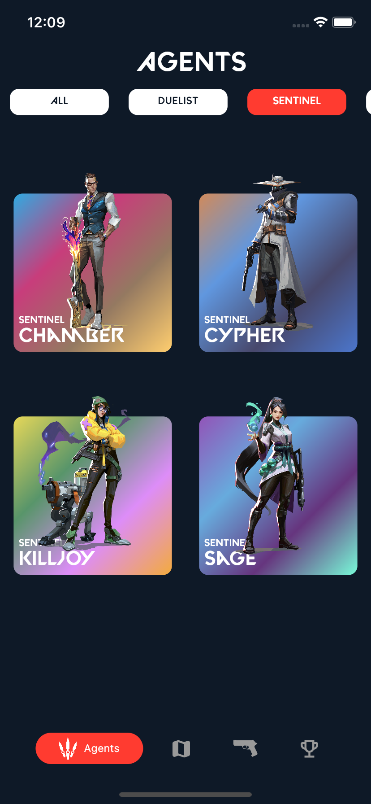
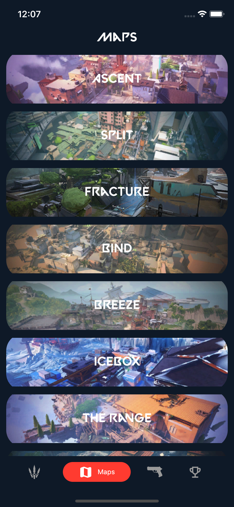
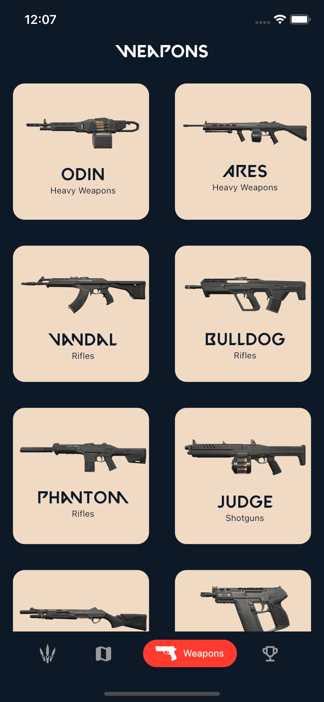
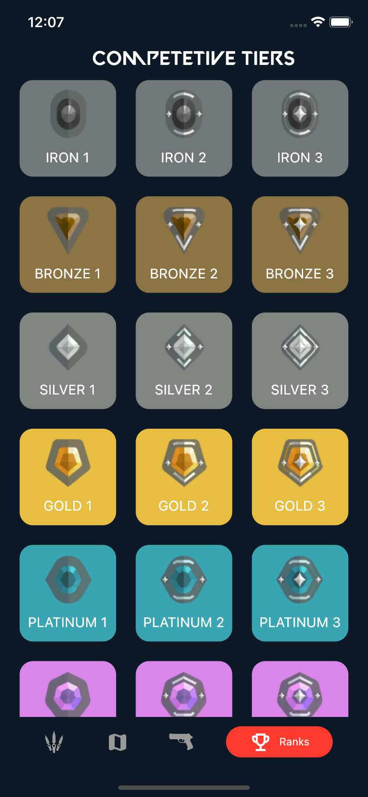

# Flutter - Valorant Guide

Valorant Guide I made with Flutter.


#### App Store
<a href="https://apps.apple.com/us/app/handbook-for-valorant/id1624518737?itsct=apps_box_badge&amp;itscg=30200" style="display: inline-block; overflow: hidden; border-radius: 13px; width: 250px; height: 83px;"></a>

#### Google Play
<a href='https://play.google.com/store/apps/details?id=com.yagizdokumaci.valorant_tips&pcampaignid=pcampaignidMKT-Other-global-all-co-prtnr-py-PartBadge-Mar2515-1' style="border-radius: 13px; width: 250px; height: 83px;"></a>

## Run Locally

Clone the project

```bash
  git clone https://github.com/yagizdo/valorant_guide
```

Go to the project directory

```bash
  cd Valorant-Guide
```

Install dependencies

```bash
  flutter pub get
```

Run App

```bash
  flutter run
```


## What will be add :question:

- [ ] Pro tips
- [ ] Add Crosshairs
- [ ] Share System for crosshairs 
- [ ] Lineups (Like viper breeze post plant lineup)
- [ ] Short agent skill videos (like breach flash short video)
- [ ] in app review system


## Valorant API
Valorant API I use: https://dash.valorant-api.com/


##  Libraries I use in the application:
- Dio : https://pub.dev/packages/dio
- Flutter Screenutil : https://pub.dev/packages/flutter_screenutil
- Persistent Bottom Navbar V2 : https://pub.dev/packages/persistent_bottom_nav_bar_v2
- Cached Network Image : https://pub.dev/packages/cached_network_image
- Hex Color : https://pub.dev/packages/hexcolor
- Flutter Native Splash : https://pub.dev/packages/flutter_native_splash
- Flutter Launcher Icons : https://pub.dev/packages/flutter_launcher_icons
- Internet Connection Checker : https://pub.dev/packages/internet_connection_checker


## App Video


https://user-images.githubusercontent.com/31064552/169157868-86a1534f-d047-4608-9c34-11706319f964.mov


## Screenshots

### Splash Screen


### Agents




### Maps



### Weapons



### Ranks



## Contributing

Contributions are always welcome!
